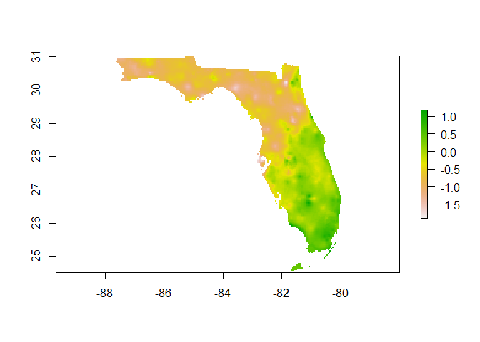
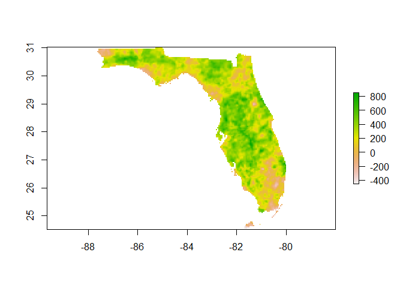

Week 4 Spatial analysis
================

## Setup

Copy and paste this code to set up:

``` r
install.packages(c("prism", "tigris" "raster", "rgdal"))


if(!dir.exists("Documents/EVS3000L")) {
dir.create("Documents/EVS3000L")
}
if(!dir.exists("Documents/EVS3000L/week4")) {
dir.create("Documents/EVS3000L/week4")
}
if(!dir.exists("Documents/EVS3000L/week4/prism")) {
dir.create("Documents/EVS3000L/week4/prism")
}
setwd("Documents/EVS3000L/week4")
```

``` r
library(dplyr)
library(ggplot2)
library(prism)
library(tigris)
library(rgdal)
```

``` r
options(prism.path = "Documents/EVS3000L/week4/prism")
```

## Download and load temperature and precipitation files

``` r
get_prism_annual(type="ppt", years = c(1985, 2014), keepZip=FALSE)
get_prism_annual(type="tmean", years = c(1985, 2014), keepZip=FALSE)
```

``` r
prism_files <- ls_prism_data()
prism_dat <- prism_stack(prism_files)
names(prism_dat) <- c("precip_1985", "precip_2014", "temp_1985", "temp_2014")
```

## Plot temperature and precipitation data

``` r
plot(prism_dat)
```

<!-- -->

## Compute variable change

``` r
precip_change = prism_dat$precip_2014 - prism_dat$precip_1985
temp_change = prism_dat$temp_2014 - prism_dat$temp_1985

plot(precip_change)
```

<!-- -->

``` r
plot(temp_change)
```

<!-- -->

## Zoom in on a state

``` r
states <- states(cb = T)
```

    ##   |                                                                              |                                                                      |   0%  |                                                                              |=                                                                     |   1%  |                                                                              |=                                                                     |   2%  |                                                                              |==                                                                    |   2%  |                                                                              |==                                                                    |   3%  |                                                                              |===                                                                   |   4%  |                                                                              |===                                                                   |   5%  |                                                                              |====                                                                  |   5%  |                                                                              |====                                                                  |   6%  |                                                                              |=====                                                                 |   7%  |                                                                              |=====                                                                 |   8%  |                                                                              |======                                                                |   8%  |                                                                              |======                                                                |   9%  |                                                                              |=======                                                               |  10%  |                                                                              |========                                                              |  11%  |                                                                              |========                                                              |  12%  |                                                                              |=========                                                             |  12%  |                                                                              |=========                                                             |  13%  |                                                                              |=========                                                             |  14%  |                                                                              |==========                                                            |  14%  |                                                                              |===========                                                           |  15%  |                                                                              |===========                                                           |  16%  |                                                                              |============                                                          |  17%  |                                                                              |============                                                          |  18%  |                                                                              |=============                                                         |  18%  |                                                                              |=============                                                         |  19%  |                                                                              |==============                                                        |  19%  |                                                                              |==============                                                        |  20%  |                                                                              |===============                                                       |  21%  |                                                                              |===============                                                       |  22%  |                                                                              |================                                                      |  22%  |                                                                              |================                                                      |  23%  |                                                                              |=================                                                     |  24%  |                                                                              |=================                                                     |  25%  |                                                                              |==================                                                    |  25%  |                                                                              |==================                                                    |  26%  |                                                                              |===================                                                   |  27%  |                                                                              |===================                                                   |  28%  |                                                                              |====================                                                  |  28%  |                                                                              |====================                                                  |  29%  |                                                                              |=====================                                                 |  29%  |                                                                              |=====================                                                 |  30%  |                                                                              |=====================                                                 |  31%  |                                                                              |======================                                                |  31%  |                                                                              |======================                                                |  32%  |                                                                              |=======================                                               |  33%  |                                                                              |========================                                              |  34%  |                                                                              |========================                                              |  35%  |                                                                              |=========================                                             |  35%  |                                                                              |=========================                                             |  36%  |                                                                              |==========================                                            |  37%  |                                                                              |==========================                                            |  38%  |                                                                              |===========================                                           |  38%  |                                                                              |===========================                                           |  39%  |                                                                              |============================                                          |  40%  |                                                                              |============================                                          |  41%  |                                                                              |=============================                                         |  41%  |                                                                              |=============================                                         |  42%  |                                                                              |==============================                                        |  42%  |                                                                              |==============================                                        |  43%  |                                                                              |===============================                                       |  44%  |                                                                              |===============================                                       |  45%  |                                                                              |================================                                      |  45%  |                                                                              |================================                                      |  46%  |                                                                              |=================================                                     |  47%  |                                                                              |==================================                                    |  48%  |                                                                              |==================================                                    |  49%  |                                                                              |===================================                                   |  49%  |                                                                              |===================================                                   |  50%  |                                                                              |===================================                                   |  51%  |                                                                              |====================================                                  |  51%  |                                                                              |====================================                                  |  52%  |                                                                              |=====================================                                 |  52%  |                                                                              |=====================================                                 |  53%  |                                                                              |======================================                                |  54%  |                                                                              |======================================                                |  55%  |                                                                              |=======================================                               |  55%  |                                                                              |=======================================                               |  56%  |                                                                              |========================================                              |  57%  |                                                                              |========================================                              |  58%  |                                                                              |=========================================                             |  58%  |                                                                              |=========================================                             |  59%  |                                                                              |==========================================                            |  59%  |                                                                              |==========================================                            |  60%  |                                                                              |==========================================                            |  61%  |                                                                              |===========================================                           |  61%  |                                                                              |===========================================                           |  62%  |                                                                              |============================================                          |  62%  |                                                                              |============================================                          |  63%  |                                                                              |=============================================                         |  64%  |                                                                              |=============================================                         |  65%  |                                                                              |==============================================                        |  65%  |                                                                              |==============================================                        |  66%  |                                                                              |===============================================                       |  66%  |                                                                              |===============================================                       |  67%  |                                                                              |===============================================                       |  68%  |                                                                              |================================================                      |  68%  |                                                                              |================================================                      |  69%  |                                                                              |=================================================                     |  70%  |                                                                              |==================================================                    |  71%  |                                                                              |==================================================                    |  72%  |                                                                              |===================================================                   |  72%  |                                                                              |===================================================                   |  73%  |                                                                              |====================================================                  |  74%  |                                                                              |====================================================                  |  75%  |                                                                              |=====================================================                 |  75%  |                                                                              |=====================================================                 |  76%  |                                                                              |======================================================                |  77%  |                                                                              |======================================================                |  78%  |                                                                              |=======================================================               |  78%  |                                                                              |=======================================================               |  79%  |                                                                              |========================================================              |  80%  |                                                                              |=========================================================             |  81%  |                                                                              |=========================================================             |  82%  |                                                                              |==========================================================            |  82%  |                                                                              |==========================================================            |  83%  |                                                                              |==========================================================            |  84%  |                                                                              |===========================================================           |  84%  |                                                                              |===========================================================           |  85%  |                                                                              |============================================================          |  85%  |                                                                              |============================================================          |  86%  |                                                                              |=============================================================         |  87%  |                                                                              |=============================================================         |  88%  |                                                                              |==============================================================        |  88%  |                                                                              |==============================================================        |  89%  |                                                                              |===============================================================       |  89%  |                                                                              |===============================================================       |  90%  |                                                                              |================================================================      |  91%  |                                                                              |================================================================      |  92%  |                                                                              |=================================================================     |  92%  |                                                                              |=================================================================     |  93%  |                                                                              |==================================================================    |  94%  |                                                                              |==================================================================    |  95%  |                                                                              |===================================================================   |  95%  |                                                                              |===================================================================   |  96%  |                                                                              |====================================================================  |  97%  |                                                                              |===================================================================== |  98%  |                                                                              |===================================================================== |  99%  |                                                                              |======================================================================|  99%  |                                                                              |======================================================================| 100%

``` r
states <- states %>%
  dplyr::select(NAME)
```

<!-- -->

Fill in a state (or territory) of your choice. Here are your options -
the text you fill in must match exactly.

``` r
unique(states$NAME)
```

    ##  [1] "Florida"                                     
    ##  [2] "United States Virgin Islands"                
    ##  [3] "Montana"                                     
    ##  [4] "Minnesota"                                   
    ##  [5] "Maryland"                                    
    ##  [6] "South Carolina"                              
    ##  [7] "Maine"                                       
    ##  [8] "Hawaii"                                      
    ##  [9] "District of Columbia"                        
    ## [10] "Commonwealth of the Northern Mariana Islands"
    ## [11] "Rhode Island"                                
    ## [12] "Nebraska"                                    
    ## [13] "Washington"                                  
    ## [14] "New Mexico"                                  
    ## [15] "Puerto Rico"                                 
    ## [16] "South Dakota"                                
    ## [17] "Texas"                                       
    ## [18] "California"                                  
    ## [19] "Alabama"                                     
    ## [20] "Georgia"                                     
    ## [21] "Arkansas"                                    
    ## [22] "Pennsylvania"                                
    ## [23] "Missouri"                                    
    ## [24] "Utah"                                        
    ## [25] "Oklahoma"                                    
    ## [26] "Tennessee"                                   
    ## [27] "Wyoming"                                     
    ## [28] "Indiana"                                     
    ## [29] "Kansas"                                      
    ## [30] "Idaho"                                       
    ## [31] "Alaska"                                      
    ## [32] "Nevada"                                      
    ## [33] "Illinois"                                    
    ## [34] "Vermont"                                     
    ## [35] "Connecticut"                                 
    ## [36] "New Jersey"                                  
    ## [37] "North Dakota"                                
    ## [38] "Iowa"                                        
    ## [39] "New Hampshire"                               
    ## [40] "Arizona"                                     
    ## [41] "Delaware"                                    
    ## [42] "Guam"                                        
    ## [43] "American Samoa"                              
    ## [44] "Kentucky"                                    
    ## [45] "Ohio"                                        
    ## [46] "Wisconsin"                                   
    ## [47] "Oregon"                                      
    ## [48] "Mississippi"                                 
    ## [49] "Colorado"                                    
    ## [50] "North Carolina"                              
    ## [51] "Virginia"                                    
    ## [52] "West Virginia"                               
    ## [53] "Louisiana"                                   
    ## [54] "New York"                                    
    ## [55] "Michigan"                                    
    ## [56] "Massachusetts"

``` r
my_state <- filter(states, NAME == "Florida")

plot(my_state)
```

<!-- -->

## Plot precipitation and temperature change for that state

``` r
library(raster)

my_state_temp_change <- crop(mask(temp_change, my_state[1,]), my_state[1,])

my_state_precip_change <- crop(mask(precip_change, my_state[1,]), my_state[1,])

plot(my_state_temp_change)
```

<!-- -->

``` r
plot(my_state_precip_change)
```

<!-- -->

## Compute mean variable change for that state

``` r
mean_temp_change =extract(my_state_temp_change, my_state[1,], fun = mean, na.rm = T)

mean_precip_change =extract(my_state_precip_change, my_state[1,], fun = mean, na.rm = T)

mean_temp_change
```

    ##            [,1]
    ## [1,] -0.4032854

``` r
mean_precip_change
```

    ##         [,1]
    ## [1,] 292.072

## Results to submit

  - Which state (or territory) did you choose?
  - Copy-paste the plots for precipitation and temperature change for
    that state or territory
  - What were the mean values for temperature and precipitation change
    for that state?

Running this code will give you all of these results:

    ## [1] "State: Florida"

<!-- --><!-- -->

    ## [1] "Mean temperature change: -0.403285406779623"

    ## [1] "Mean precipitation change: 292.07196225829"

## Reflection questions
